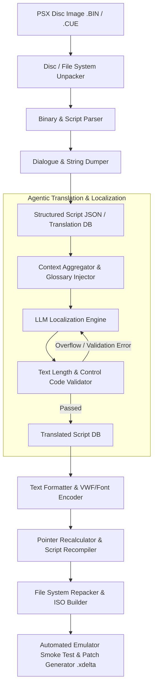

# Persona Fan Translation Project

An automated, agentic translation and romhacking pipeline dedicated to creating faithful, uncut, and atmosphere-preserving English localizations for classic PlayStation 1 (PSX) *Shin Megami Tensei: Persona* games.

---

## 🎯 Primary Focus: *Megami Ibunroku Persona* (女神異聞録ペルソナ)

The first and main objective of this project is the complete, faithful English localization of the original 1996 PlayStation release of **Megami Ibunroku Persona**.

### Why This Project?
- **Revelations: Persona (1996 US Release) Deficiencies:**
  - Cut an entire major storyline branch: the **Snow Queen Quest** (雪の女王編).
  - Heavy Americanization and erasure of Japanese cultural setting (e.g., Mikage-cho turned into "Lunarvale", Yen turned into Dollars).
  - Radical alterations to character sprites, portraits, and names (e.g., Masao "Mark" Inaba, Maki "Mary" Sonomura, Kei "Nate" Nanjo).
  - Heavily altered demon negotiation dialogue, simplified mechanics, and cut shrines/rooms.
- **The PSP Remake (2009) Trade-offs:**
  - While it offered a faithful translation and restored the Snow Queen Quest, it completely replaced the original PSX dark atmospheric soundtrack, altered visual presentation, UI, and pre-rendered cutscenes.
- **Our Goal:**
  - Deliver a definitive, uncut English experience on the original PlayStation hardware/emulators with the classic atmosphere, original soundtrack, restored cultural context, and modern localization standards.

---

## 🎮 Target Games

| Title | Platform | Status |
|---|---|---|
| **Megami Ibunroku Persona** (*女神異聞録ペルソナ*) | PSX | 🚧 In Planning / Reverse Engineering |
| **Persona 2: Innocent Sin** (*ペルソナ2 罪*) | PSX | 📋 Planned |
| **Persona 2: Eternal Punishment** (*ペルソナ2 罰*) | PSX | 📋 Planned |
| **Sumaru TV Special Disc** (*スマルTVスペシャルディスク*) | PSX | 📋 Planned |

---

## 🧠 100% Agentic Translation Pipeline Architecture

This project leverages an autonomous AI agent workflow to handle everything from reverse-engineering and script extraction to translation, text fitting, pointer recalculation, and patch compilation.



---

## 🛠️ Repository Structure

```text
├── psx/                  # Disc images and ROMs (git-ignored)
├── tools/                # Extraction, insertion, and compression tools
├── scripts/              # Extracted scripts and translation databases (JSON/PO)
├── patches/              # Assembly patches, VWF routines, and build scripts
├── docs/                 # Format documentation, tables, and reverse engineering notes
└── README.md
```

---

## 📜 License & Disclaimer

This is a non-profit fan translation project. *Shin Megami Tensei*, *Persona*, and *Megami Ibunroku Persona* are registered trademarks of **ATLUS / SEGA**. All original game assets belong to their respective copyright holders. This repository does not distribute copyrighted ROMs or game binaries.
